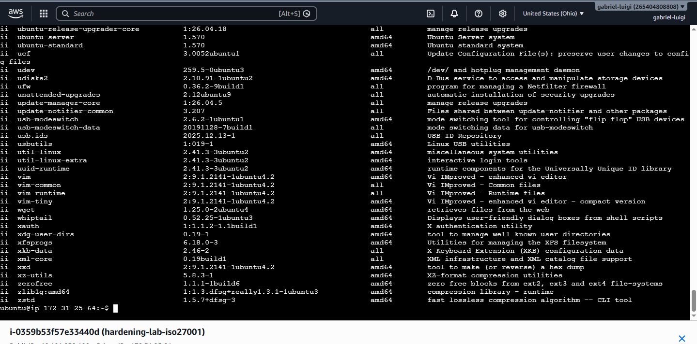
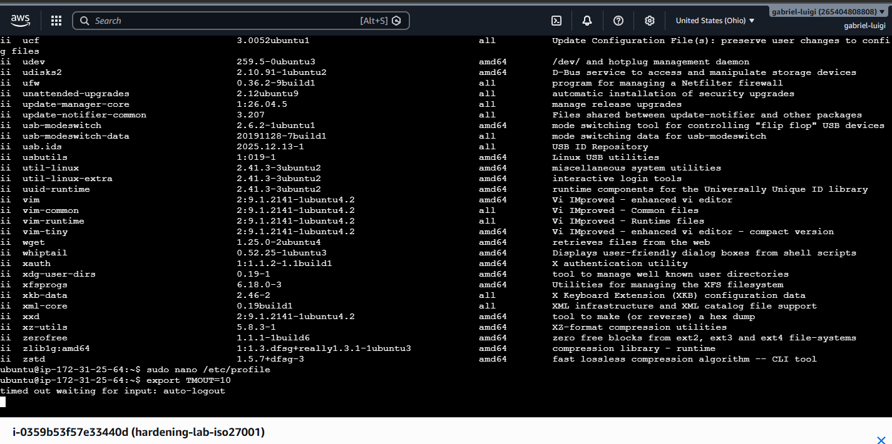
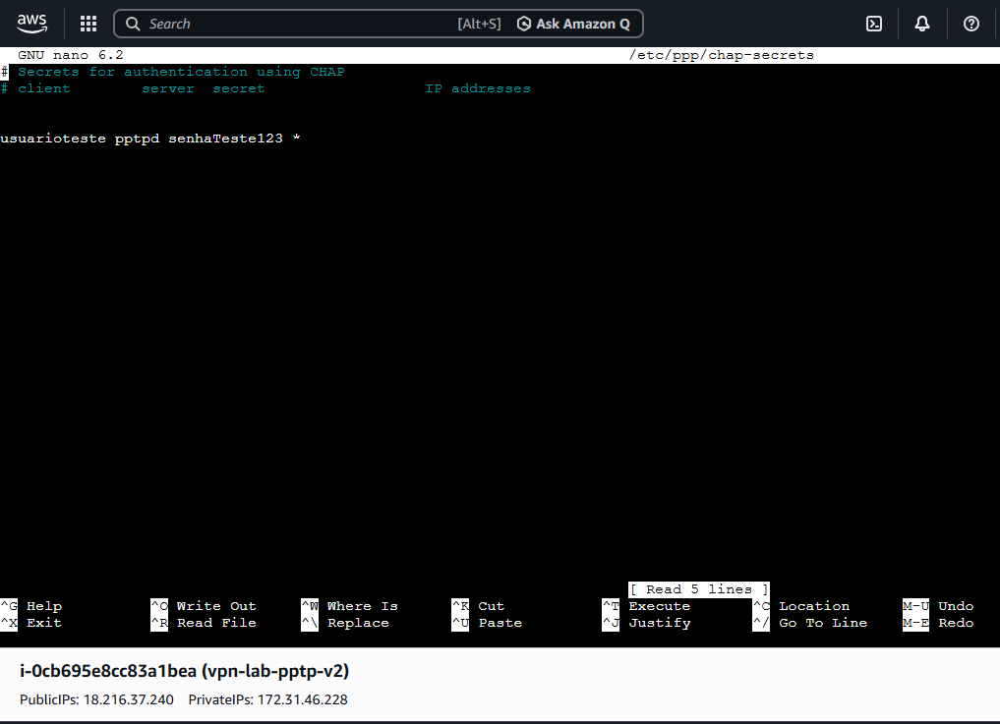
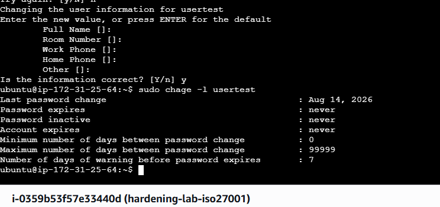
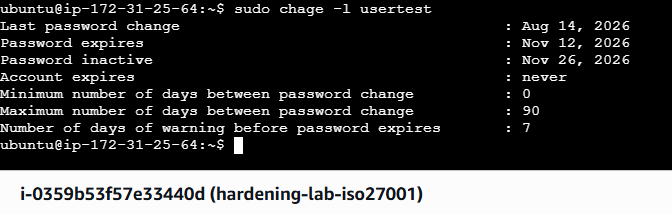
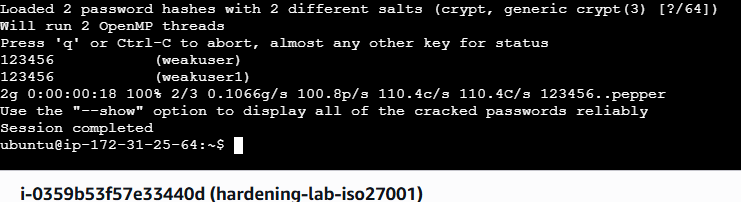

# Hardening de Linux - ISO/IEC 27001

Aplicação prática de controles de segurança da informação da norma ISO/IEC 27001 em um servidor Linux Ubuntu (ambiente de laboratório AWS EC2).

[Read in English](README.md)

## Objetivo

Simular uma auditoria real de hardening em Linux, aplicando e documentando controles frequentemente cobrados em vagas de Segurança da Informação e Cloud.

## Ambiente

- Ubuntu Server (AWS EC2)
- Usuário padrão com privilégios sudo

## Controles Aplicados

1. **Auditoria de pacotes instalados** - listagem de todos os pacotes instalados (`dpkg -l`) para revisão de baseline.
2. **Timeout de sessão do terminal** - configuração de logout automático por inatividade (`/etc/profile`, `TMOUT`).
3. **Bloqueio da conta root** - desabilitação do login direto como root, forçando responsabilização via contas nomeadas + sudo.
4. **Política de expiração de senha** - aplicação de expiração, aviso e bloqueio por inatividade (`chage -M 90 -W 7 -I 14`).
5. **Detecção de senha fraca (bônus)** - uso do John the Ripper para demonstrar como senhas fracas (ex: `123456`) são facilmente quebradas, reforçando a necessidade de políticas de senha fortes.

## Evidências

### 1. Auditoria de pacotes instalados


### 2. Timeout de sessão do terminal


### 3. Bloqueio da conta root


### 4. Política de expiração de senha - antes


### 5. Política de expiração de senha - depois


### 6. Senha fraca quebrada (John the Ripper)


> Observação: se alguma imagem acima não aparecer, confira se o nome do arquivo correspondente dentro da pasta `images/` bate exatamente com o caminho referenciado aqui (diferencia maiúsculas/minúsculas, sem extensões duplicadas).

## Comandos Principais

```bash
# Auditoria de pacotes
sudo dpkg -l | sudo tee /root/documents/auditoria.txt > /dev/null

# Política de expiração de senha
sudo chage -M 90 -W 7 -I 14 usertest
sudo chage -l usertest

# Teste de senha fraca
sudo unshadow /etc/passwd /etc/shadow > /tmp/senhas.txt
sudo john /tmp/senhas.txt
```

## Observações

- O ambiente de laboratório (instância AWS EC2) foi finalizado após o exercício para evitar custos desnecessários na nuvem.
- O algoritmo de hash SHA-512 foi habilitado temporariamente (em vez do padrão yescrypt do Ubuntu) para permitir compatibilidade com o John the Ripper (edição core), apenas para fins de demonstração.
